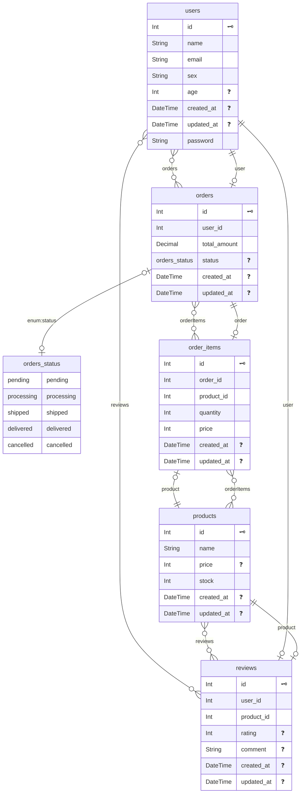

```mermaid
erDiagram

        orders_status {
            pending pending
processing processing
shipped shipped
delivered delivered
cancelled cancelled
        }
    
  "users" {
    Int id "🗝️"
    String name 
    String email 
    String sex 
    Int age "❓"
    DateTime created_at "❓"
    DateTime updated_at "❓"
    String password 
    }
  

  "products" {
    Int id "🗝️"
    String name 
    Int price "❓"
    Int stock 
    DateTime created_at "❓"
    DateTime updated_at "❓"
    }
  

  "orders" {
    Int id "🗝️"
    Int user_id 
    Decimal total_amount 
    orders_status status "❓"
    DateTime created_at "❓"
    DateTime updated_at "❓"
    }
  

  "order_items" {
    Int id "🗝️"
    Int order_id 
    Int product_id 
    Int quantity 
    Int price 
    DateTime created_at "❓"
    DateTime updated_at "❓"
    }
  

  "reviews" {
    Int id "🗝️"
    Int user_id 
    Int product_id 
    Int rating "❓"
    String comment "❓"
    DateTime created_at "❓"
    DateTime updated_at "❓"
    }
  
    "users" o{--}o "orders" : "orders"
    "users" o{--}o "reviews" : "reviews"
    "products" o{--}o "order_items" : "orderItems"
    "products" o{--}o "reviews" : "reviews"
    "orders" o|--|o "orders_status" : "enum:status"
    "orders" o{--}o "order_items" : "orderItems"
    "orders" o|--|| "users" : "user"
    "order_items" o|--|| "orders" : "order"
    "order_items" o|--|| "products" : "product"
    "reviews" o|--|| "users" : "user"
    "reviews" o|--|| "products" : "product"
```
